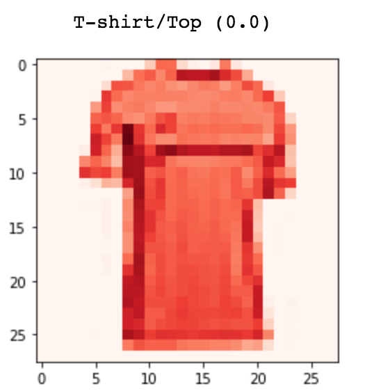
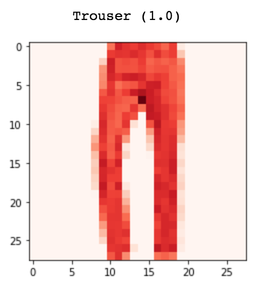
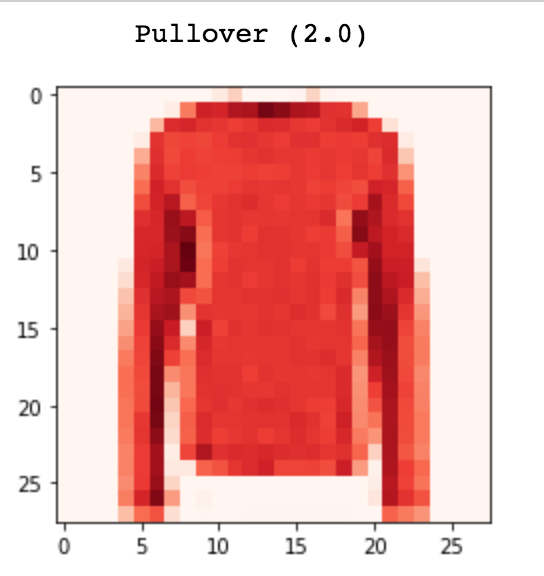
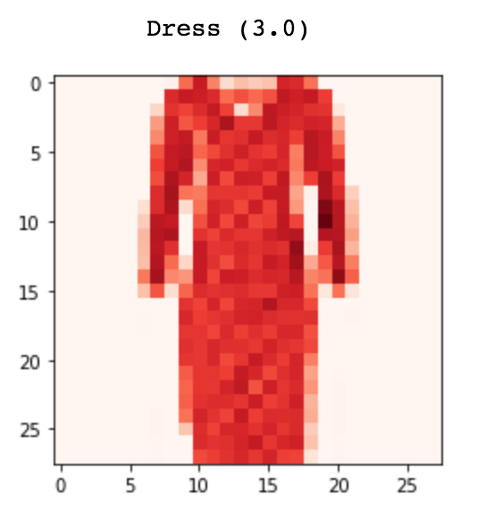
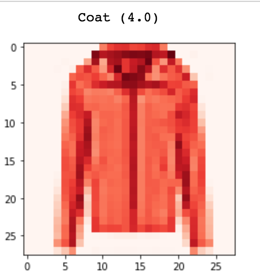
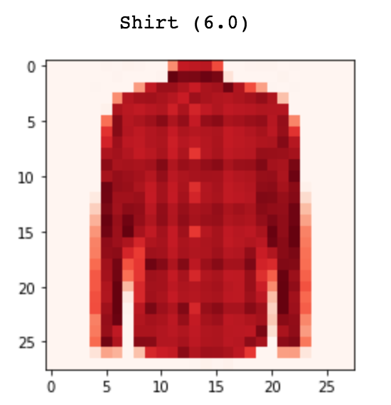
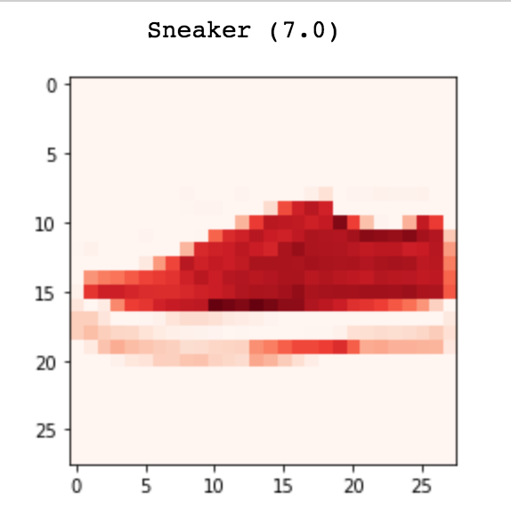
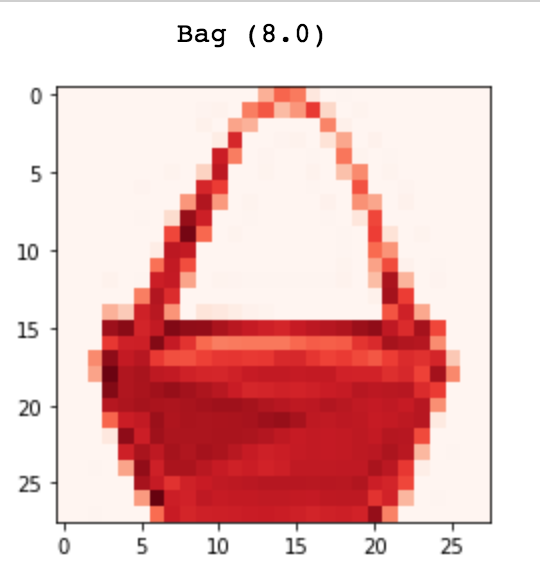
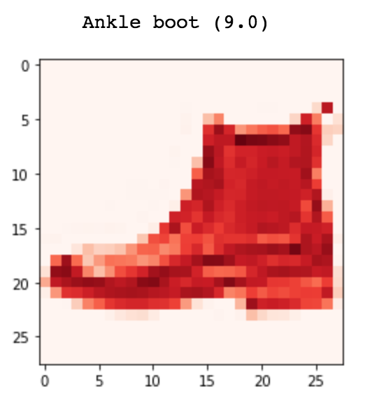

# Fashion Classification

This case study is very helpful for the recommendation system and also much beneficial for Fashion, Retail, and E-Commerce industry to suggest more content or products to their customer and improve their customer experience.

Here, I have a training set consists of 70,000 sample images of Fashion Products. Dataset sample consists of a 28x28 grayscale image, associated with a label from 10 Product Categories are as follows:
 

 
In this case study, I assume that the Ecommerce Platform or a Retail Shop of fashion products has 60,000 products from above Product Category. I trained our model to predict products (10,000 products) used by our customers in the past. So, we can recommend similar products of there choice to them.
 
 
 
<pre>
<b>Test Accuracy : 92</b>
</pre>
 
 
I tried 32 fliters first and then 64 fliters with and without dropout of 0.25 to improve the performance of our model (CNN - used TensorFlow backend for Keras). 
  Test Accuracy of our modal is raised from around 90% to 92%. 
  
I tried to comment and mantain code very well but sill if you have any query ping <em><a href="https://www.linkedin.com/in/mrnikhilgupta/" rel="nofollow">me (Nikhil Gupta)</a></em>.
