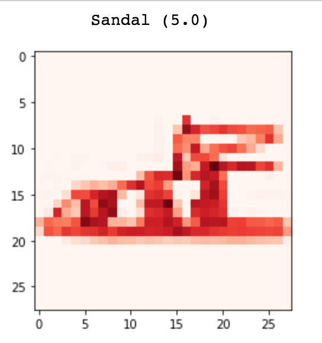

# Fashion Classification

This case study is very helpful for the recommendation system and also much beneficial for Fashion, Retail, and E-Commerce industry to suggest more content or products to their customer and improve their customer experience.

Here, I have a training set consists of 70,000 sample images of Fashion Products. Dataset sample consists of a 28x28 grayscale image, associated with a label from 10 Product Categories are as follows:
 

 
In this case study, I assume that the Ecommerce Platform or the Retail Shop of fashion products has 60,000 products from above Product Category. I trained my model to predict the Product Category of 10,000 products used by the customers in the past. So, we can recommend similar products of their choice to them.
 
 
 
<pre>
<b>Test Accuracy : 92</b>
</pre>
 
 
I tried 32 filters first. Then 64 filters with and without a dropout of 0.25 to improve the performance of my model (CNN - used TensorFlow backend for Keras). 
 
 
The test Accuracy of my modal is raised from around 90% to 92%. 
 
 
I tried to comment and maintain code very well but sill, if you have any query ping <em><a href="https://www.linkedin.com/in/mrnikhilgupta/" rel="nofollow">me (Nikhil Gupta)</a></em>.
 
 
<em>*Due to bigger size of data, I won't be able to share it with you here. Ping me if you need this dataset.</em>
